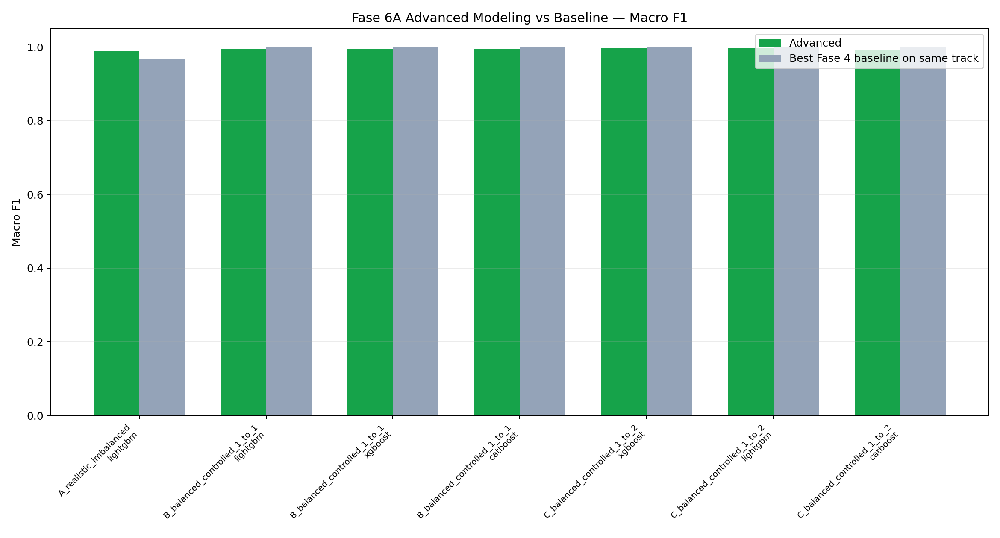
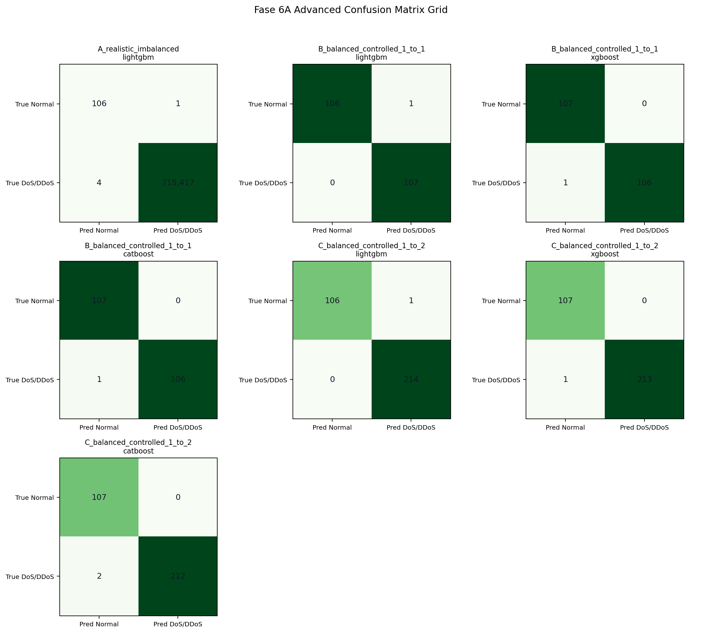
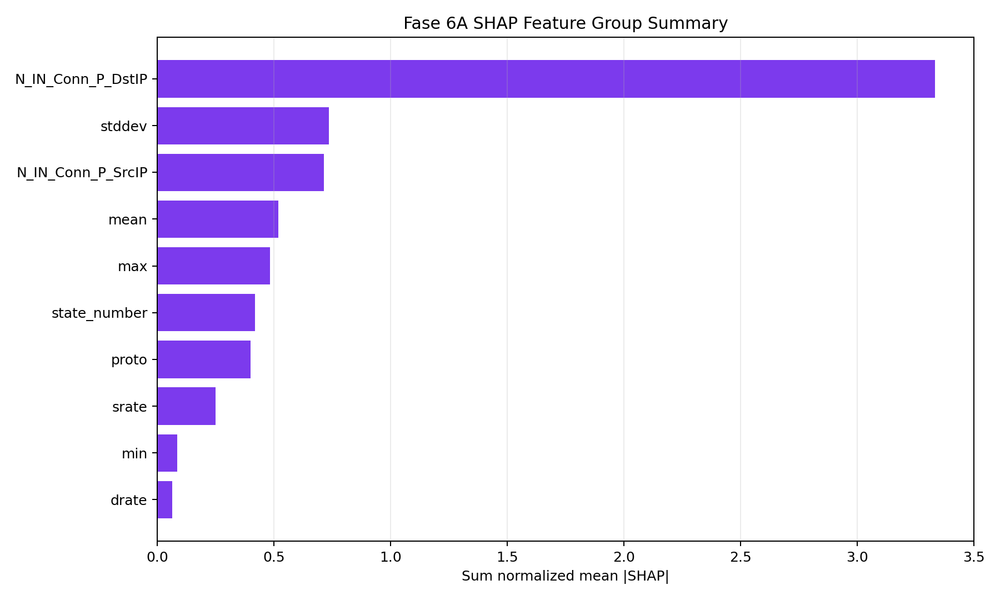
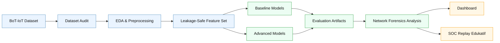
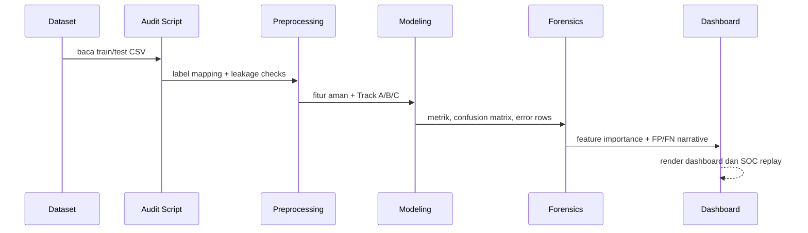

<div align="center">

# IoT DoS Forensics IDS

**Sistem Analisis Serangan DoS pada Arsitektur IoT**  
Machine Learning · Network Forensics · BoT-IoT · SOC Replay Edukatif

[](#quick-start)
[](#validasi)
[](https://research.unsw.edu.au/projects/bot-iot-dataset)
[](https://feb027.github.io/iot-dos-forensics-ids/)
[](#batasan-akademik)
[](LICENSE)
[](https://github.com/feb027/iot-dos-forensics-ids/releases/tag/v1.0-uas-final)

[Dashboard Utama](https://feb027.github.io/iot-dos-forensics-ids/) ·
[SOC Replay Edukatif](https://iot.aquarise.my.id/soc-demo/demo.html) ·
[Artefak Eksperimen](results/) ·
[Dataset BoT-IoT](https://research.unsw.edu.au/projects/bot-iot-dataset)

</div>

---

## Ringkasnya

Repositori ini adalah proyek UAS individu IoT Semester 6 untuk menganalisis pola **DoS/DDoS pada trafik IoT** menggunakan dataset **BoT-IoT (UNSW)**. Proyek mencakup audit dataset, EDA, preprocessing anti-leakage, baseline model, advanced tabular model, interpretasi forensik fitur trafik, dashboard hasil, dan halaman SOC replay edukatif.

> Fokus utama: **normal vs DoS/DDoS**, bukan menyerang perangkat asli dan bukan IDS produksi real-time.

## Highlight Hasil

| Area | Ringkasan |
|---|---|
| Dataset diaudit | **3,668,522** baris dari mirror CSV BoT-IoT yang ditelusuri ke sumber resmi UNSW |
| Target utama | `normal` vs `dos_or_ddos`; serangan lain tidak dipaksa menjadi normal |
| Anti-leakage | Label, ID, IP, dan port dikeluarkan dari fitur model |
| Baseline terbaik Track A | Decision Tree, Macro F1 **0.9667**, MCC **0.9344** |
| Advanced terbaik Track A | LightGBM, Macro F1 **0.9885**, MCC **0.9770** |
| Fitur forensik dominan | `N_IN_Conn_P_DstIP`, `N_IN_Conn_P_SrcIP`, `stddev`, `srate`, `mean` |
| Demo | Dashboard statis + SOC replay edukatif berbasis artefak eksperimen |

<details>
<summary><strong>Catatan interpretasi hasil</strong></summary>

- Metrik utama yang dipakai adalah Macro F1, MCC, recall, confusion matrix, serta analisis FP/FN.
- Accuracy tidak dijadikan klaim utama karena kelas normal sangat kecil.
- Track B/C adalah subset terkendali; hasilnya tidak boleh digeneralisasi berlebihan.
- Interpretasi fitur dibaca sebagai bukti berbasis dataset, bukan bukti kausal dunia nyata.

</details>

## Visual Artefak

| Perbandingan Model | Confusion Matrix | Explainability |
|---|---|---|
|  |  |  |

## Cara Kerja Sistem



## Pipeline Eksperimen



## Struktur Repositori

```text
backend/     FastAPI untuk demo SOC replay
dashboard/   Dashboard statis, data JSON, dan halaman SOC replay
data/        Folder lokal dataset mentah/proses; tidak di-commit
notebooks/   Notebook EDA, preprocessing, modeling, dan forensik
references/  Literature matrix, BibTeX, dan sumber rujukan
results/     Metrik, tabel, dan figure hasil eksperimen
scripts/     Script reproducible untuk audit sampai dashboard
tests/       Unit tests dan smoke tests
```

## Quick Start

### 1. Clone dan install dependensi

```bash
gh repo clone feb027/iot-dos-forensics-ids
cd iot-dos-forensics-ids
python3 -m venv .venv
source .venv/bin/activate
pip install -r requirements.txt
```

### 2. Validasi kode dan data dashboard

```bash
python3 -m py_compile scripts/*.py backend/iot_soc_api/*.py
python3 -m pytest -q
python3 scripts/generate_dashboard_data.py
```

### 3. Jalankan dashboard lokal

```bash
python3 -m http.server 8000 -d dashboard
```

Buka:

```text
http://localhost:8000/
http://localhost:8000/demo.html
```

## Reproduksi Eksperimen

> Dataset mentah BoT-IoT tidak disimpan di repo. Letakkan data mentah sesuai path lokal yang dipakai script, lalu jalankan tahap berikut sesuai kebutuhan.

```bash
python3 scripts/audit_botiot_dataset.py
python3 scripts/run_eda_preprocessing.py
python3 scripts/run_baseline_modeling.py
python3 scripts/run_advanced_modeling.py
python3 scripts/run_forensic_analysis.py
python3 scripts/generate_demo_scenarios.py
python3 scripts/generate_dashboard_data.py
```

## Artefak Utama

| Kategori | Path |
|---|---|
| Dataset audit | `results/metrics/dataset_audit.json` |
| Preprocessing | `results/metrics/preprocessing_summary.json` |
| Baseline modeling | `results/metrics/baseline_summary.json` |
| Advanced modeling | `results/metrics/advanced_summary.json` |
| Forensic analysis | `results/metrics/forensic_summary.json` |
| Model metrics | `results/tables/advanced_model_metrics.csv` |
| Feature importance | `results/tables/forensic_feature_importance.csv` |
| Error analysis | `results/tables/forensic_error_analysis.csv` |
| Dashboard data | `dashboard/data/dashboard-data.json` |
| Demo scenarios | `dashboard/data/demo-scenarios.json` |

## Dataset

- **Dataset utama:** BoT-IoT (UNSW)  
  https://research.unsw.edu.au/projects/bot-iot-dataset
- **Dataset alternatif untuk pengembangan lanjutan:** RT-IoT2022 (UCI)  
  https://archive.ics.uci.edu/dataset/942/rt-iot2022

Dataset mentah tidak disimpan di repositori karena ukurannya besar. Repo hanya menyimpan kode, ringkasan hasil, tabel, figure, dan JSON dashboard yang aman dibagikan.

## Sitasi dan Lisensi

Jika repositori atau artefaknya digunakan sebagai rujukan, gunakan metadata pada [`CITATION.cff`](CITATION.cff). Kode dan dokumentasi proyek ini dirilis dengan lisensi [`MIT`](LICENSE).

```text
Febnawan Fatur Rochman. (2026). IoT DoS Forensics IDS: Sistem Analisis Serangan DoS pada Arsitektur IoT. GitHub. https://github.com/feb027/iot-dos-forensics-ids
```

## Batasan Akademik

- Proyek ini berbasis dataset/simulasi, bukan perangkat IoT fisik.
- Dashboard bukan IDS produksi real-time.
- SOC replay bukan replay PCAP aktual; visualisasi dibuat dari artefak eksperimen.
- Hasil tidak diklaim universal untuk semua jaringan IoT.
- Kelas normal pada data yang diaudit sangat kecil, sehingga evaluasi harus dibaca hati-hati.
- Tidak ada raw dataset, kredensial, file PCAP besar, atau model binary besar yang di-commit.

## Validasi

Validasi terakhir yang dipakai pada repo ini:

```bash
python3 -m py_compile scripts/*.py backend/iot_soc_api/*.py
python3 -m pytest -q
# 27 passed
```

---

<div align="center">

Dibuat untuk UAS IoT Semester 6 — Informatika A, FT UNSIL Tasikmalaya.

</div>
